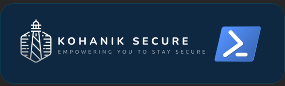

# PowerShell Script Collection

Welcome to my collection of PowerShell scripts! This repository contains a variety of scripts designed to automate system administration tasks and improve efficiency.

## Overview

These scripts range from functional and still in testing, all covering a wide range of system administration needs. Whether you're managing endpoints, servers, or other IT infrastructure, you'll find scripts here to help streamline your workflows.

## Usage

All scripts are intended to be run locally, but keep in mind that some may require specific permissions or configurations to execute successfully. Here's what you need to know:

- **Permissions:** Many scripts require a service account with local administrator access or global administrator access, depending on the tasks they perform. Ensure your account has the necessary permissions before running these scripts.
- **Configuration:** Some scripts may require additional configurations to be set up on endpoints, servers, or other systems. Please refer to any additional notes provided within the scripts themselves for guidance.

## Getting Started

To get started with these scripts, follow these steps:

1. Clone this repository to your local machine.
2. Review the scripts and their accompanying documentation to understand their purpose and requirements.
3. Ensure you have the necessary permissions and configurations in place before running any scripts.
4. Execute the scripts as needed, either individually or as part of a larger automation workflow.

## Contributing

If you have improvements, bug fixes, or new scripts to contribute, feel free to submit a pull request! Contributions are welcome and appreciated.

## License

This project is FREE USE, which means you are free to use, modify, and distribute the scripts as you see fit.

---

**Note:** Always use caution when running scripts, especially those that interact with critical systems or sensitive data. Review scripts thoroughly before execution, and test them in a non-production environment whenever possible.
